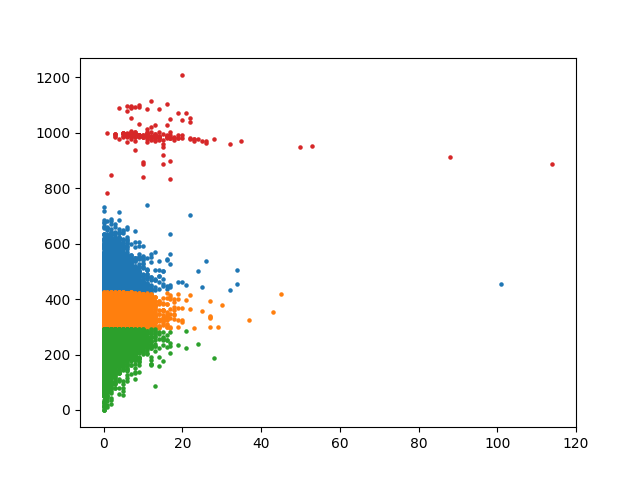

# K-Means Clustering

This is the implementation of the k-means clustering algorithm. This project has been tested with pyhon3.6; other python versions may not work.

It should be enough with the configuration from the Main.py file as to include/exclude graphs, visualizations, setting different cluster numbers, etc.



To use the code, you need to create a model object: ```model = Kmeans.Kmeans(k, data)```. Over the model object, then you just call the train method, statting whether you want or not a visualization of the datapoints with the final clasiffication categories. **Note:** This visualization is only avaliable for 2 dimensional datasets, i.e. sets with 2 features.

The Train method returns the total sum of distaces of every datapoint with respect to its related centroid. Thus, to plot the Elbow Metthod's graph, you must collect each of these sums. This is donde in the ```plot_distances``` method, which automatically shows the graph described.
